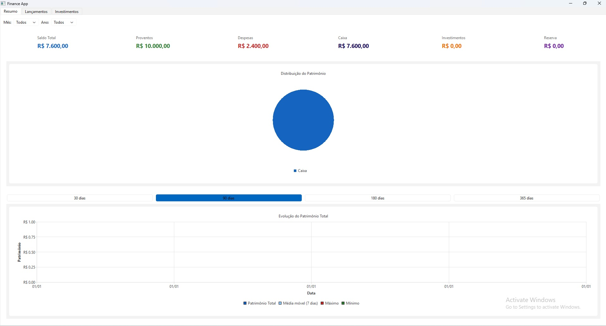
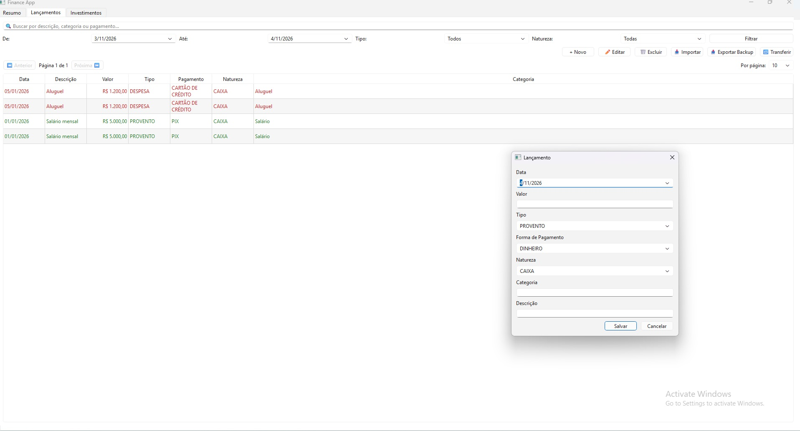

# 💰 Finance App

Aplicação desktop para controle financeiro pessoal e gestão de investimentos, desenvolvida em Python com foco em organização, análise e visualização de dados financeiros.

---

## 🚀 Funcionalidades

### 📊 Gestão financeira

* Cadastro de receitas e despesas
* Controle de lançamentos financeiros
* Transferências entre contas

### 📈 Investimentos

* Cadastro de ativos
* Controle de posições
* Cálculo de preço médio
* Acompanhamento de variação de investimentos

### 📉 Visualização de dados

* Gráficos de evolução patrimonial
* Distribuição de investimentos
* Dashboard com resumo financeiro

### 🧠 Arquitetura organizada

* Separação por camadas (Domain, Services, Repositories)
* Código modular e escalável
* Testes automatizados

---

## 🛠️ Tecnologias utilizadas

* **Python**
* **PySide6** (interface gráfica)
* **SQLite** (banco de dados)
* **Plotly** (visualização de gráficos)
* **Pytest** (testes)

---

## 📂 Estrutura do projeto

```
finance_app/
│
├── core/               # Configurações e serviços principais
├── domain/             # Entidades do sistema
├── infrastructure/     # Banco de dados e integração
├── repositories/       # Acesso aos dados
├── services/           # Regras de negócio
├── ui/                 # Interface gráfica (PySide6)
├── tests/              # Testes automatizados
│
├── app.py              # Inicialização
├── main.py             # Execução principal
├── requirements.txt
```

---

## ⚙️ Como rodar o projeto

### 1. Clonar o repositório

```bash
git clone https://github.com/DevLucasMelloo/finance-app.git
cd finance-app
```

### 2. Criar ambiente virtual

```bash
python -m venv venv
```

### 3. Ativar ambiente

**Windows:**

```bash
venv\Scripts\activate
```

**Linux/Mac:**

```bash
source venv/bin/activate
```

### 4. Instalar dependências

```bash
pip install -r requirements.txt
```

### 5. Rodar aplicação

```bash
python main.py
```

---

## 🧪 Testes

Para rodar os testes:

```bash
pytest
```

---

## 📸 Screenshots





---

## 🎯 Objetivo do projeto

Este projeto foi desenvolvido com o objetivo de:

* Praticar arquitetura de software
* Trabalhar com aplicações desktop
* Aplicar conceitos de orientação a objetos
* Simular um sistema real de controle financeiro

---

## 📌 Melhorias futuras

* Integração com APIs de mercado financeiro
* Suporte a múltiplos usuários
* Exportação de relatórios
* Deploy da aplicação

---

## 👨‍💻 Autor

Desenvolvido por **Lucas Feliciano Mello**

* GitHub: https://github.com/DevLucasMelloo

---

## ⭐ Se gostou do projeto

Deixe uma estrela no repositório!
